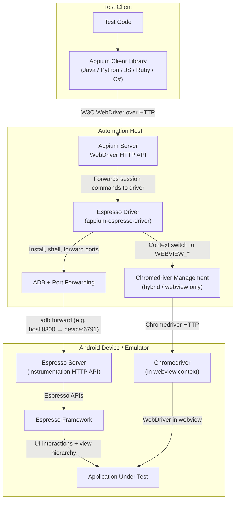

# Architecture

```mermaid
flowchart TD
  subgraph ClientSide["Test Client"]
    T["Test Code"]
    CL["Appium Client Library<br/>(Java / Python / JS / Ruby / C#)"]
  end

  subgraph ServerHost["Automation Host"]
    AS["Appium Server<br/>WebDriver HTTP API"]
    XD["Espresso Driver<br/>(appium-espresso-driver)"]
    ADBM["ADB + Port Forwarding"]
    CDM["Chromedriver Management<br/>(hybrid / webview only)"]
  end

  subgraph DeviceTarget["Android Device / Emulator"]
    ES["Espresso Server<br/>(instrumentation HTTP API)"]
    ESP["Espresso Framework"]
    CD["Chromedriver<br/>(in webview context)"]
    AUT["Application Under Test"]
  end

  T --> CL
  CL -->|"W3C WebDriver over HTTP"| AS
  AS -->|"Forwards session commands to driver"| XD
  XD -->|"Install, shell, forward ports"| ADBM
  XD -->|"Context switch to WEBVIEW_*"| CDM
  ADBM -->|"adb forward (e.g. host:8300 → device:6791)"| ES
  CDM -->|"Chromedriver HTTP"| CD
  ES -->|"Espresso APIs"| ESP
  ESP -->|"UI interactions + view hierarchy"| AUT
  CD -->|"WebDriver in webview"| AUT
```
