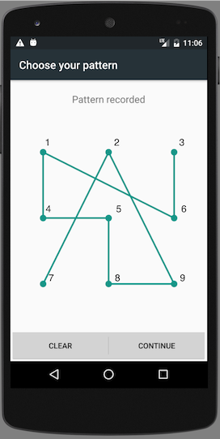

The Espresso driver allows interactions with the Android lock screen using various APIs.

## Available APIs

The driver provides several capabilities for unlocking the device screen on session startup:

- [`appium:skipUnlock`](../reference/capabilities.md#skipunlock)
- [`appium:unlockType`](../reference/capabilities.md#unlocktype)
- [`appium:unlockKey`](../reference/capabilities.md#unlockkey)
- [`appium:unlockStrategy`](../reference/capabilities.md#unlockstrategy)
- [`appium:unlockSuccessTimeout`](../reference/capabilities.md#unlocksuccesstimeout)

Additionally, the driver includes execute methods for locking or unlocking the device during the
session:

- [`mobile: lock`](../reference/execute-methods.md#mobile-lock)
- [`mobile: unlock`](../reference/execute-methods.md#mobile-unlock)
- [`mobile: isLocked`](../reference/execute-methods.md#mobile-islocked)

## Unlock Types

The above capabilities and execute methods support multiple unlock types, which change the
expected format of the unlock key.

### `pin`

Can be used for PIN code-based lockscreens. The unlock key should match the PIN code and consist of
its digits, for example `1111`.

Under the hood, the driver simply searches for button elements matching each digit in the PIN code,
and taps on them.

### `pinWithKeyEvent`

Can be used for PIN code-based lockscreens. Equivalent to the [`pin`](#pin) type, but implemented
by sending key events via `adb` instead.

### `password`

Can be used for password-based lockscreens. The unlock key should match the password and consist of
latin characters, for example `abcd1234`.

### `pattern`

Can be used for pattern-based lockscreens. The unlock key should be a sequence of digits, where
each digit matches a pattern point, when ordered left-to-right, top-to-down.

For example, the unlock key in the following image is `729854163`.

### `fingerprint`

Can be used for fingerprint-based lockscreens. Only supported on emulators. The unlock key should
be the identifier of the virtual fingerprint, similarly to the [`mobile: fingerprint`](../reference/execute-methods.md#mobile-fingerprint)
execute method.
