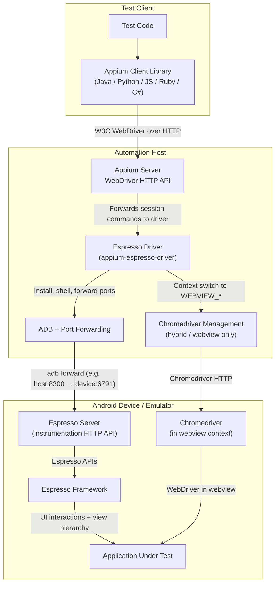

---
hide:
  - navigation

title: Overview
---

The Espresso driver is an Appium driver intended for grey-box automated testing of native and
hybrid Android applications.

## Target Platforms

The driver supports the following Android platforms as automation targets:

|Platform|Simulators|Real devices|
|--|--|--|
|Android|:white_check_mark:|:white_check_mark:|
|Android TV|:question: [^untested]|:question: [^untested]|
|Wear OS|:question: [^untested]|:question: [^untested]|
|Android XR|:question: [^untested]|:question: [^untested]|
|Android Auto|:x:|:x:|
|Android Automotive|:question: [^untested]|:question: [^untested]|

## Contexts

The following application contexts are supported for automation:

- Native applications
- Webviews based on Chrome
- Hybrid applications

## Technologies Used

The Espresso driver uses the [W3C WebDriver protocol](https://www.w3.org/TR/webdriver/) for session
management. Under the hood, the driver combines several different technologies to achieve its
functionality:

- Native testing
    - Based on Android's [Espresso testing library](https://developer.android.com/training/testing/espresso/)
    - Provided by the bundled Espresso server application
- Webview testing
    - Based on [the ChromeDriver server](https://developer.chrome.com/docs/chromedriver)
    - Provided by the [`appium-chromedriver`](https://github.com/appium/appium-chromedriver) library
- Additional tools
    - Support for `adb` is handled by the [`appium-adb`](https://github.com/appium/appium-adb) library
    - Management of certain Android settings is handled by the [`io.appium.settings`](https://github.com/appium/io.appium.settings) library

Several libraries and other features are shared with [the Appium UiAutomator2 driver](https://github.com/appium/appium-uiautomator2-driver),
as part of the [`appium-android-driver`](https://github.com/appium/appium-android-driver) library.

## End-to-End Architecture

The diagram below is intentionally the simplest end-to-end example. Cloud service providers, device
farms, network gateways, and sophisticated local setups may insert additional layers between the
client library and the automation host.

[^untested]: Not tested, though likely to still work
