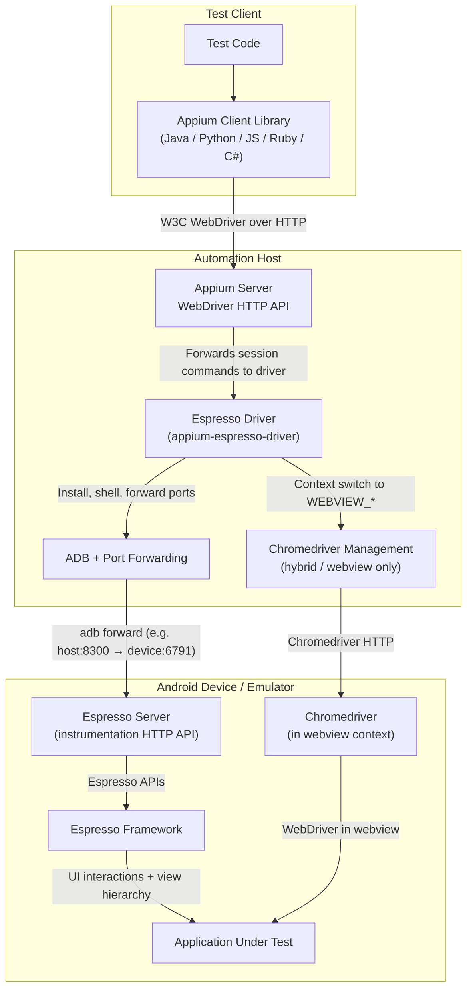

---
hide:
  - navigation

title: Overview
---

The Espresso driver is an Appium driver intended for grey-box automated testing of native and
hybrid Android applications.

## Key Design Principle

Most other Appium drivers such as [UiAutomator2](https://github.com/appium/appium-uiautomator2-driver)
are used for black-box testing, so before using the Espresso driver, it is critical to understand
how its grey-box approach is different.

Grey-box testing is more closely coupled to the app under test than black-box testing, which means
two things:

* The Espresso driver can access in-depth information about the app under test that is not exposed
  to black-box drivers: off-screen elements, element tag values, use of [IdlingResource](https://developer.android.com/reference/androidx/test/espresso/IdlingResource),
  and more
* The Espresso driver requires the tester to have knowledge of the source code of the app under
  test - specifically, the version numbers of various tools and dependencies used to build the
  exact tested version of the app

These version numbers are important: in order to attach to the app, the driver automatically builds
its own helper application (the Espresso server) using many of the same standard Android application
tools and dependencies, then installs this server on the device. If there are any version
incompatibilities between the app and the Espresso server, ^^session creation will simply not work^^.

In order to avoid this problem, it is necessary to specify all of the required version numbers,
which is done using the [`appium:espressoBuildConfig`](./reference/capabilities.md#espressobuildconfig)
session capability.

## Target Platforms

The driver supports the following Android platforms as automation targets:

|Platform|Simulators|Real devices|
|--|--|--|
|Android|:white_check_mark:|:white_check_mark:|
|Android TV|:white_check_mark:|:question: [^untested]|
|Android Wear / Wear OS|:white_check_mark:|:question: [^untested]|
|Android XR|:white_check_mark:|:question: [^untested]|
|Android Auto|:x:|:x:|
|Android Automotive|:white_check_mark:|:question: [^untested]|

## Contexts

The following application contexts are supported for automation:

* Native applications
* Webviews based on Chrome
* Hybrid applications

## Technologies Used

The Espresso driver uses the [W3C WebDriver protocol](https://www.w3.org/TR/webdriver/) for session
management. Under the hood, the driver combines several different technologies to achieve its
functionality:

* Native testing
    * Based on Android's [Espresso testing library](https://developer.android.com/training/testing/espresso/)
    * Provided by the bundled Espresso server application
* Webview testing
    * Based on [the ChromeDriver server](https://developer.chrome.com/docs/chromedriver)
    * Provided by the [`appium-chromedriver`](https://github.com/appium/appium-chromedriver) library
* Additional tools
    * Support for `adb` is handled by the [`appium-adb`](https://github.com/appium/appium-adb) library
    * Management of certain Android settings is handled by the [`io.appium.settings`](https://github.com/appium/io.appium.settings) library

Several libraries and other features are shared with [the Appium UiAutomator2 driver](https://github.com/appium/appium-uiautomator2-driver),
as part of the [`appium-android-driver`](https://github.com/appium/appium-android-driver) library.

## End-to-End Architecture

The diagram below is intentionally the simplest end-to-end example. Cloud service providers, device
farms, network gateways, and sophisticated local setups may insert additional layers between the
client library and the automation host.

[^untested]: Not tested
